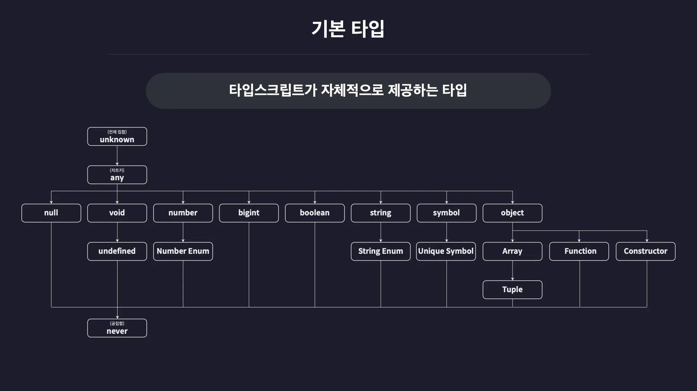

# TypeScript 기본 타입 가이드



## 목차
1. [기본 원시 타입](#기본-원시-타입)
2. [객체 타입](#객체-타입)
3. [배열과 튜플](#배열과-튜플)
4. [함수 타입](#함수-타입)
5. [유니언과 인터섹션](#유니언과-인터섹션)
6. [리터럴 타입](#리터럴-타입)
7. [특수 타입](#특수-타입)
8. [타입 별칭과 인터페이스](#타입-별칭과-인터페이스)
9. [제네릭 기초](#제네릭-기초)
10. [실무 팁](#실무-팁)

---

## 기본 원시 타입

### 1. number
```typescript
let age: number = 25;
let price: number = 99.99;
let binary: number = 0b1010; // 이진수
let octal: number = 0o744;   // 8진수
let hex: number = 0xf00d;    // 16진수
```

### 2. string
```typescript
let name: string = "홍길동";
let greeting: string = `안녕하세요, ${name}님!`;
let multiline: string = `
  여러 줄
  문자열
`;
```

### 3. boolean
```typescript
let isActive: boolean = true;
let isCompleted: boolean = false;
let isLoggedIn: boolean = Boolean(user);
```

### 4. null과 undefined
```typescript
let emptyValue: null = null;
let notDefined: undefined = undefined;

// strictNullChecks 옵션에 따라 다르게 동작
let maybeString: string | null = null;
let maybeNumber: number | undefined = undefined;
```

---

## 객체 타입

### 1. 객체 타입 정의
```typescript
// 인라인 타입 정의
let user: { name: string; age: number } = {
  name: "김철수",
  age: 30
};

// 선택적 프로퍼티
let product: { name: string; price?: number } = {
  name: "노트북"
  // price는 선택사항
};

// 읽기 전용 프로퍼티
let config: { readonly apiUrl: string } = {
  apiUrl: "https://api.example.com"
};
```

### 2. 인덱스 시그니처
```typescript
// 문자열 키를 가진 객체
let scores: { [key: string]: number } = {
  "수학": 90,
  "영어": 85,
  "과학": 92
};

// 숫자 키를 가진 객체
let items: { [index: number]: string } = {
  0: "첫번째",
  1: "두번째"
};
```

---

## 배열과 튜플

### 1. 배열 타입
```typescript
// 방법 1: 타입[]
let numbers: number[] = [1, 2, 3, 4, 5];
let names: string[] = ["김철수", "이영희", "박민수"];

// 방법 2: Array<타입>
let scores: Array<number> = [90, 85, 92];
let users: Array<string> = ["user1", "user2"];

// 다차원 배열
let matrix: number[][] = [[1, 2], [3, 4]];
```

### 2. 튜플 타입
```typescript
// 고정된 길이와 타입의 배열
let point: [number, number] = [10, 20];
let user: [string, number, boolean] = ["홍길동", 25, true];

// 선택적 요소
let optional: [string, number?] = ["hello"];

// 나머지 요소
let rest: [string, ...number[]] = ["label", 1, 2, 3];

// 읽기 전용 튜플
let readonly: readonly [string, number] = ["fixed", 100];
```

---

## 함수 타입

### 1. 함수 선언과 타입
```typescript
// 함수 선언
function add(a: number, b: number): number {
  return a + b;
}

// 함수 표현식
const multiply = (a: number, b: number): number => a * b;

// 선택적 매개변수
function greet(name: string, greeting?: string): string {
  return `${greeting || "안녕하세요"}, ${name}님!`;
}

// 기본값 매개변수
function createUser(name: string, age: number = 0): object {
  return { name, age };
}

// 나머지 매개변수
function sum(...numbers: number[]): number {
  return numbers.reduce((total, num) => total + num, 0);
}
```

### 2. 함수 타입 정의
```typescript
// 함수 타입 별칭
type Calculator = (a: number, b: number) => number;

let add: Calculator = (a, b) => a + b;
let subtract: Calculator = (a, b) => a - b;

// 콜백 함수
function processArray(arr: number[], callback: (item: number) => number): number[] {
  return arr.map(callback);
}

// 오버로드
function combine(a: number, b: number): number;
function combine(a: string, b: string): string;
function combine(a: any, b: any): any {
  return a + b;
}
```

---

## 유니언과 인터섹션

### 1. 유니언 타입 (Union Types)
```typescript
// 여러 타입 중 하나
let value: string | number = "hello";
value = 42; // 가능

// 리터럴 유니언
let status: "loading" | "success" | "error" = "loading";

// 배열 유니언
let data: string[] | number[] = ["a", "b", "c"];

// 타입 가드
function processValue(value: string | number): string {
  if (typeof value === "string") {
    return value.toUpperCase();
  } else {
    return value.toString();
  }
}
```

### 2. 인터섹션 타입 (Intersection Types)
```typescript
// 여러 타입을 모두 만족
type User = {
  name: string;
  age: number;
};

type Admin = {
  role: string;
  permissions: string[];
};

type AdminUser = User & Admin;

let admin: AdminUser = {
  name: "관리자",
  age: 35,
  role: "admin",
  permissions: ["read", "write", "delete"]
};
```

---

## 리터럴 타입

### 1. 문자열 리터럴
```typescript
let direction: "north" | "south" | "east" | "west" = "north";
let theme: "light" | "dark" = "light";

// 함수에서 사용
function setTheme(theme: "light" | "dark"): void {
  document.body.className = theme;
}
```

### 2. 숫자 리터럴
```typescript
let dice: 1 | 2 | 3 | 4 | 5 | 6 = 1;
let httpStatus: 200 | 404 | 500 = 200;
```

### 3. 불린 리터럴
```typescript
let isTrue: true = true;
let isFalse: false = false;
```

---

## 특수 타입

### 1. any
```typescript
// 모든 타입을 허용 (권장하지 않음)
let anything: any = 42;
anything = "hello";
anything = true;
anything.foo.bar; // 에러 없음
```

### 2. unknown
```typescript
// 타입이 확실하지 않은 값 (any보다 안전)
let userInput: unknown;
userInput = 5;
userInput = "hello";

// 타입 체크 후 사용
if (typeof userInput === "string") {
  console.log(userInput.toUpperCase());
}
```

### 3. void
```typescript
// 반환값이 없는 함수
function log(message: string): void {
  console.log(message);
}

// 변수에도 사용 가능 (하지만 거의 사용하지 않음)
let unusable: void = undefined;
```

### 4. never
```typescript
// 절대 발생하지 않는 값
function error(message: string): never {
  throw new Error(message);
}

function infiniteLoop(): never {
  while (true) {
    // 무한 루프
  }
}

// 타입 체크에서 모든 케이스를 처리했는지 확인
function processStatus(status: "success" | "error"): string {
  switch (status) {
    case "success":
      return "성공";
    case "error":
      return "실패";
    default:
      // 모든 케이스를 처리했다면 이 부분은 never 타입
      const exhaustiveCheck: never = status;
      return exhaustiveCheck;
  }
}
```

---

## 타입 별칭과 인터페이스

### 1. 타입 별칭 (Type Aliases)
```typescript
// 기본 타입 별칭
type ID = string | number;
type UserID = ID;

// 객체 타입 별칭
type User = {
  id: ID;
  name: string;
  email: string;
  createdAt: Date;
};

// 함수 타입 별칭
type EventHandler = (event: Event) => void;
type ApiResponse<T> = {
  data: T;
  status: number;
  message: string;
};
```

### 2. 인터페이스 (Interfaces)
```typescript
// 기본 인터페이스
interface User {
  id: string;
  name: string;
  email: string;
}

// 인터페이스 확장
interface AdminUser extends User {
  role: string;
  permissions: string[];
}

// 다중 상속
interface Timestamped {
  createdAt: Date;
  updatedAt: Date;
}

interface FullUser extends User, Timestamped {
  isActive: boolean;
}

// 인터페이스 병합
interface Window {
  customProperty: string;
}
// 기존 Window 인터페이스에 추가됨
```

### 3. 타입 vs 인터페이스
```typescript
// 타입 별칭 - 유니언, 기본 타입 등에 사용
type StringOrNumber = string | number;
type Point = [number, number];

// 인터페이스 - 객체 구조 정의에 주로 사용
interface Shape {
  area(): number;
}

interface Circle extends Shape {
  radius: number;
}
```

---

## 제네릭 기초

### 1. 기본 제네릭
```typescript
// 제네릭 함수
function identity<T>(arg: T): T {
  return arg;
}

let output1 = identity<string>("hello");
let output2 = identity<number>(42);
let output3 = identity("world"); // 타입 추론

// 제네릭 배열
function getFirstElement<T>(arr: T[]): T | undefined {
  return arr[0];
}

let first = getFirstElement([1, 2, 3]); // number | undefined
let firstStr = getFirstElement(["a", "b", "c"]); // string | undefined
```

### 2. 제네릭 인터페이스
```typescript
interface Container<T> {
  value: T;
  getValue(): T;
  setValue(value: T): void;
}

class NumberContainer implements Container<number> {
  constructor(public value: number) {}
  
  getValue(): number {
    return this.value;
  }
  
  setValue(value: number): void {
    this.value = value;
  }
}
```

### 3. 제네릭 제약 조건
```typescript
// 특정 프로퍼티를 가진 타입만 허용
interface Lengthwise {
  length: number;
}

function logLength<T extends Lengthwise>(arg: T): T {
  console.log(arg.length);
  return arg;
}

logLength("hello"); // 가능
logLength([1, 2, 3]); // 가능
// logLength(123); // 에러: number에는 length가 없음
```

---

## 실무 팁

### 1. 타입 단언 (Type Assertion)
```typescript
// DOM 요소 타입 단언
const canvas = document.getElementById("canvas") as HTMLCanvasElement;
const input = document.querySelector(".input") as HTMLInputElement;

// 객체 타입 단언 (주의해서 사용)
const user = {} as User;
user.name = "홍길동";
```

### 2. 타입 가드 함수
```typescript
// 사용자 정의 타입 가드
function isString(value: any): value is string {
  return typeof value === "string";
}

function isUser(obj: any): obj is User {
  return obj && typeof obj.name === "string" && typeof obj.age === "number";
}

// 사용 예
function processData(data: unknown) {
  if (isString(data)) {
    // 이 블록에서 data는 string 타입
    console.log(data.toUpperCase());
  }
}
```

### 3. 유틸리티 타입 활용
```typescript
// Partial - 모든 프로퍼티를 선택적으로
interface User {
  name: string;
  age: number;
  email: string;
}

type PartialUser = Partial<User>; // 모든 프로퍼티가 선택적

// Pick - 특정 프로퍼티만 선택
type UserPreview = Pick<User, "name" | "email">;

// Omit - 특정 프로퍼티 제외
type UserWithoutEmail = Omit<User, "email">;

// Record - 키-값 타입 정의
type UserRoles = Record<string, "admin" | "user" | "guest">;
```

### 4. 타입 추론 활용
```typescript
// 함수 반환 타입 추론
function createUser(name: string, age: number) {
  return { name, age, isActive: true };
}

// ReturnType 유틸리티 타입으로 반환 타입 추출
type CreateUserReturn = ReturnType<typeof createUser>;
// { name: string; age: number; isActive: boolean; }
```

### 5. 조건부 타입 기초
```typescript
// 조건부 타입
type ApiResponse<T> = T extends string 
  ? { message: T } 
  : { data: T };

type StringResponse = ApiResponse<string>; // { message: string }
type NumberResponse = ApiResponse<number>; // { data: number }
```

### 6. 실무에서 자주 사용하는 패턴
```typescript
// API 응답 타입
interface ApiResponse<T> {
  success: boolean;
  data?: T;
  error?: string;
  timestamp: number;
}

// 상태 관리 타입
type LoadingState = "idle" | "loading" | "success" | "error";

interface AsyncState<T> {
  data: T | null;
  status: LoadingState;
  error: string | null;
}

// 이벤트 핸들러 타입
type EventHandler<T = Event> = (event: T) => void;
type ClickHandler = EventHandler<MouseEvent>;
type ChangeHandler = EventHandler<ChangeEvent<HTMLInputElement>>;
```

---

## 마무리

**다음 단계:**
- 고급 타입 (Advanced Types)
- 클래스와 상속
- 모듈과 네임스페이스
- 데코레이터
- 컴파일러 옵션

**추천 학습 순서:**
1. 기본 타입과 함수 타입 숙지
2. 인터페이스와 타입 별칭 활용
3. 제네릭 기초 이해
4. 유틸리티 타입 활용
5. 실무 프로젝트에서 점진적 적용

